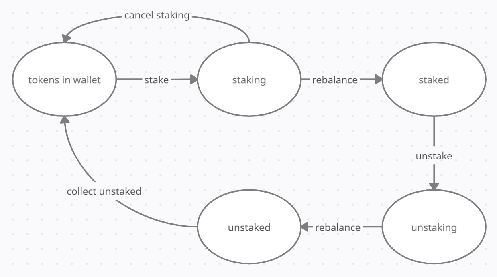

## Basket

Basket is a decentralized automated fund with the goal of providing increased performance relative to XRD and exposure to the growth of the radix ecosystem without
the need to manage individual investments. The fund is managed by stakers who earn a positive or negative yield based on the relative performance of the tokens they 
get the fund to buy and are incentivised with fees. Investers into the fund receive Basket tokens which are pegged to the the value of assets held by the fund.

### Buying and selling

When a user invests into the fund, the fee percent is deducted and used to buy Samusky tokens which are then distrabued among stake pools. The fund then buys tokens 
in proportion to stakes using the stake denominator:
```
D = stake denominator
R = radix reserve percent
S_t = total of all stake pool amounts

D = S_t * (R + 100) / 100

b = amount of token to buy
a = radix amount invested
S = stake pool amount

b = a * S / D
```
This creates a remainder which put into the radix reserve. An amount of Basket tokens with a value equal to the investment minus the fee are then minted and returned to the buyer:
```
n = basket token amount to mint
N = basket token total supply
a = radix amount invested
v_t = total value of all assets (investments + reserve)

n = a * N / (v_t - a)
```
Note, this does not appear to be a linear function as expected, but it is as `v_t` is has a hidden term of `a` plus some delta from slippage from the buying. This is done so the buyer pays the cost of any slippage. Selling is more simple and works by selling the Basket tokens share of all assets. These mechanisms ensure the price of Basket tokens is pegged to the value of assets held by the fund.

### Staking

Stakes are created using Samusky tokens and tracked using StakeReceipt nfts. They have a four stage life cycle: staking, staked, unstaking, and unstaked. This life cycle is necessary because staking and unstaking must occur at rebalance to prevent gaming the mechanism. Stakes have an amount and a weight. When a stake is first created the amount is set to the amount of tokens being staked. At the transition to being staked the weight is calculated using this amount and the current state of the stake pool:
```
w = weight
W = stake pool total weight
s = stake amount
S = stake pool amount

w = ((s + S) / S - 1) * W
```
If it is the first stake for the stake pool then the weight is arbitrary. At the transition to being unstaked the weight is used to calculate the stakes 
share of the pool and update the amount. This updated amount is the amount the user can collect. The full state machine is the following: 



### Rebalancing

In order for the ratio of the value of investments to track the ratio of stakes they must be regularly rebalanced. This is done by a public method that anyone can 
call, as the more often the better. It is expected that this would be periodically done by the team behind Basket, but users staking or unstaking are also 
incentivized to call this method in order to process the stake. To rebalance the following must be calculated:
```
m = mean
S = stake pool amount
S_t = total of all stake pool amounts
p_1 = price
p_0 = price at last rebalance

m = (Σ S * p_1 / p_0) / S_t

c = mean adjusted change

c = p_1 / (p_0 * m) - 1
```
Stakes are changed by the mean adjusted change to reflect their perforance and the rebalance amounts are calculated:
```
r = rebalance amount
D = stake denominator
v = value of investment
v_t = total value of all assets (investments + reserve)

r = v_t * S / D - v
```
Investment values are changed by the rebalance amount by buying or selling.

### Reserve

The radix reserve holds two purposes. First it avoids problems caused by slippage when buying or selling. This means the reserve percent should never be set too low. 
Second it causes the fund to naturally buy more when the market falls and sell more when the market rises.

### Admin badge

Basket uses a admin badge to whitelist new investments, change the reserve percent, and change the fee percent. In the future this badge could possibly be handed 
over to a DAO to remove all centralization if it is deemed beneficial and sufficiently secure.

### Investing in more than tokens?

In order to rebalance the fund all investments must be immediately reverseable. However, many complicated financial products can have their mechanism simplified down 
to a token. This should allow Basket to invest into a variety of defi components.

### DEXs and Radiswap

In order to buy and sell tokens Basket requires a amm dex. The current demo uses a modifided version of Radiswap, one of the scrypto examples from radixdlt. The 
modification is a orcale function to provide price. In production, Basket will be able to make use of any available amm dex by making an adapter component 
from the dex to the generic inferface that Basket uses.

### Getting started

To run the demo first make sure you have python installed. Then start the python interpreter:
```
python
```
Next import the demo:
```
from demo import *
```
Run setup to create all the necessary components:
```
setup()
```
You are now ready for testing! For example you could run the following:
```
add_investment(pool_A)
add_investment(pool_B)
add_investment(pool_C)
stake(30, pool_A)
stake(20, pool_B)
stake(10, pool_C)
rebalance()
buy(100)
show(basket)
show(account)
```

#### Variables
- `account`
- `basket`
- `pool_A`
- `pool_B`
- `pool_C`
- `lp_token_A`
- `lp_token_B`
- `lp_token_C`

#### Functions
- `show(address)`
- `add_investment(pool)`
- `set_radix_reserve_percent(reserve_percent)`
- `set_fee_percent(fee_percent)`
- `buy(amount)`
- `sell(amount)`
- `stake(amount, pool)`
- `unstake(id)`
- `cancel_staking(id)`
- `collect_unstaked(id)`
- `rebalance()`
- `get_prices()`
- `get_amounts()`
- `get_mean_adjusted_changes()`
- `get_total_value()`
- `get_value()`
- `get_total_stake()`
- `get_stake_denominator()`
- `amm_buy(amount, pool)`
- `amm_remove_liquidity(amount, lp_token, pool)`
