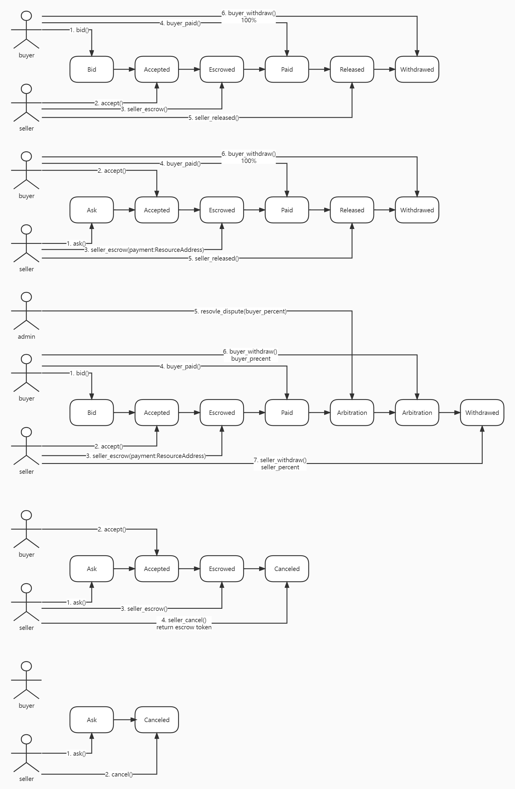

# DexC2C

DexC2C is a decentralized RADIX token otc trading service that allows you to create buy or sell orders that can be shared on social networks to match counterparties, or to specify and send to a counterparty to complete a transaction.

## Features

- Create an intention to buy or sell
- Seller escrow funds security, transparent and visible to buyers
- In the event of the purchase and sale dispute, the admin can intervene to resolve it by confirming the share ratio and writing the adjusted percentage into the contract
- The transaction process is not dependent on third parties and is guaranteed by contract

## Ticket

To ensure that the contract is not abused, the creation or acceptance of an intention requires the user to first pledge XRD to obtain a ticket, this ticket is a kind of NFT, where each contract call during the progression of the order status requires the presentation of the badge as buyer or seller. After the transaction is completed, the pledged XRD can be redeemed by refund_ticket(). To simplify the process, the workflow does not reflect the ticket part of the process.

## Work flow



## Build & Run (with window powershell)

- Environment preparation and reset.
- Create 3 accounts

| name  | usage                        |
| ----- | ---------------------------- |
| admin | Used to deploy the contract. |
| p1    | buyer                        |
| p2    | seller                       |

windows shell

```shell
scrypto build
resim reset
$result=resim publish .
$package=$result.substring("Success! New Package: ".length,$result.length-"Success! New Package: ".length)

$result=resim new-account
$admin=($result[1]).substring("Account component address: ".length,($result[1]).length-"Account component address: ".length)
$admin_priv=($result[3]).substring("Private key: ".length,($result[3]).length-"Private key: ".length)

$result=resim new-account
$p1=($result[1]).substring("Account component address: ".length,($result[1]).length-"Account component address: ".length)
$p1_priv=($result[3]).substring("Private key: ".length,($result[3]).length-"Private key: ".length)

$result=resim new-account
$p2=($result[1]).substring("Account component address: ".length,($result[1]).length-"Account component address: ".length)
$p2_priv=($result[3]).substring("Private key: ".length,($result[3]).length-"Private key: ".length)
$xrd='030000000000000000000000000000000000000000000000000004'
```

MacOS shell

```shell
scrypto build
resim reset
result=$(resim new-account)
export admin=$(echo $result|grep "Account component address: "|awk -F ": " '{print $2}'|awk -F " " '{print $1}')
export admin_priv=$(echo $result|grep "Private key:" |awk -F "Private key: " '{print $2}'|awk -F "" '{print $1}')
result=$(resim new-account)
export p1=$(echo $result|grep "Account component address: "|awk -F ": " '{print $2}'|awk -F " " '{print $1}')
export p1_priv=$(echo $result|grep "Private key:" |awk -F "Private key: " '{print $2}')
result=$(resim new-account)
export p2=$(echo $result|grep "Account component address: "|awk -F ": " '{print $2}'|awk -F " " '{print $1}')
export p2_priv=$(echo $result|grep "Private key:" |awk -F "Private key: " '{print $2}')

export $xrd='030000000000000000000000000000000000000000000000000004'
result=$(resim publish ".")
export package=$(echo $result | awk -F ": " '{print $2}')
```

- Init component

```shell
$result=resim call-function $package DexC2C new 100
$component=($result[10]).substring('鈹斺攢 Component: '.length, ($result[10]).length-'鈹斺攢 Component: '.length)
$ticket=($result[13]).substring('鈹斺攢 Resource: '.length, ($result[13]).length-'鈹斺攢 Resource: '.length)
```

MacOS shell

```
result=$(resim call-function $package DexC2C "new" 100)
export component=$(echo $result | grep "Component: "| awk -F "Component: " '{print $2}' | awk -F " " '{print $1}')
export ticket=$(echo $result | grep "Resource: " | awk -F "Resource: " '{if (NR==1) print $4}')
```

- An example of a complete process including arbitration

```shell
1: buyer buy ticket
    resim set-default-account $p1 $p1_priv
    resim call-method $component buy_ticket 100,$xrd
    resim show $p1

2: seller buy ticket
    resim set-default-account $p2 $p2_priv
    resim call-method $component buy_ticket 100,$xrd
    resim show $p2

3: seller ask
    resim set-default-account $p2 $p2_priv
    resim call-method $component "ask" 1 2 $xrd 10 "Ask dispute test" "#0000000000000002,$ticket"
    resim call-method $component get_pending_order_by_id 1

4: buyer accept
    resim set-default-account $p1 $p1_priv
    resim call-method $component accept 1 "#0000000000000001,$ticket"
    resim call-method $component get_pending_order_by_id 1

5: seller escrow
    resim set-default-account $p2 $p2_priv
    resim call-method $component seller_escrow 1 10,$xrd '#0000000000000002',$ticket
    resim call-method $component get_pending_order_by_id 1

6: buyer paid
    resim set-default-account $p1 $p1_priv
    resim call-method $component buyer_paid 1 '#0000000000000001',$ticket
    resim call-method $component get_pending_order_by_id 1

7: admin resolve dispute
    resim set-default-account $admin $admin_priv
    resim run resolve_dispute.txt (Note that replacing the variable)

8: buyer withdraw
    resim set-default-account $p1 $p1_priv
    resim call-method $component buyer_withdraw 1 '#0000000000000001',$ticket
    resim show $p1

9: seller withdraw
    resim set-default-account $p2 $p2_priv
    resim call-method $component seller_withdraw 1 '#0000000000000002',$ticket
    resim show $p2
```
